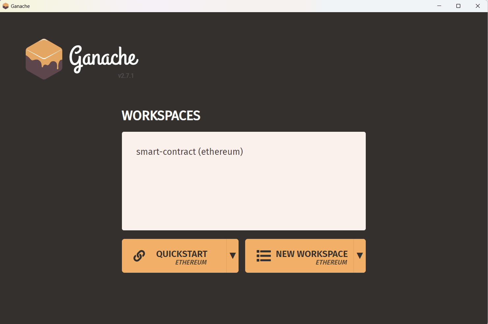
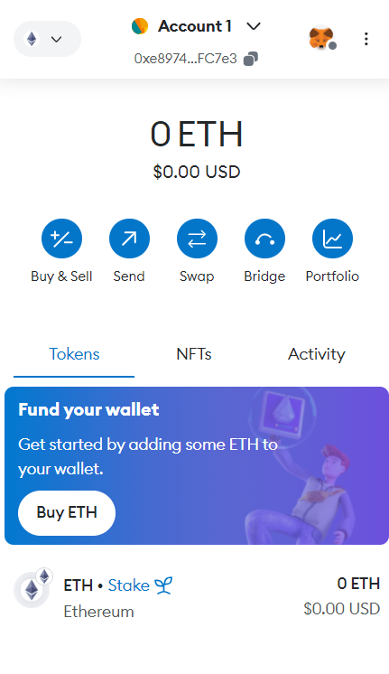
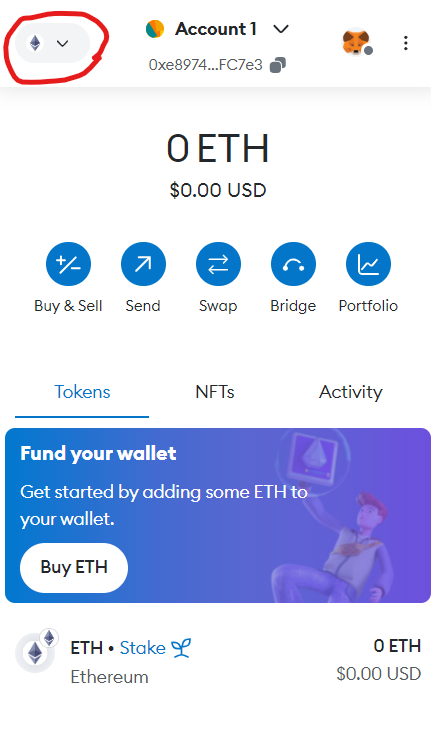
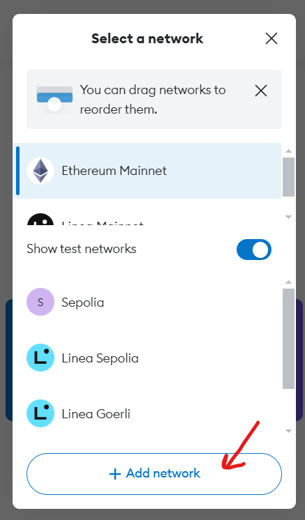
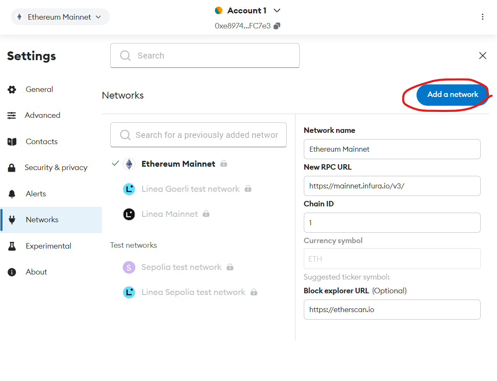
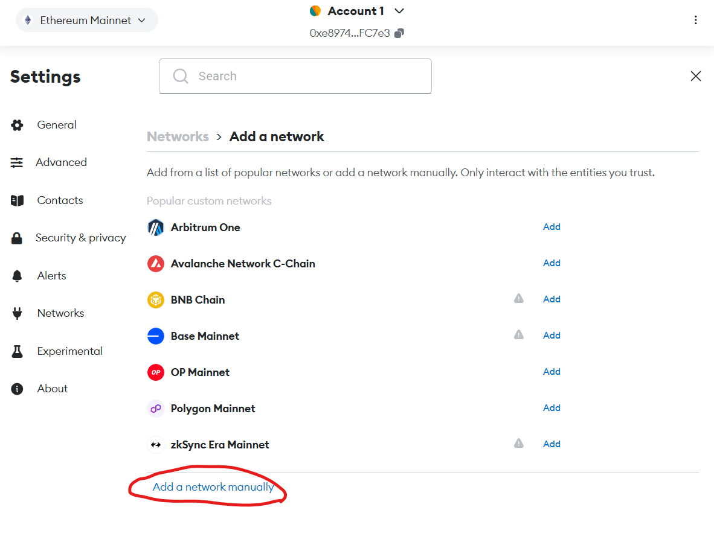
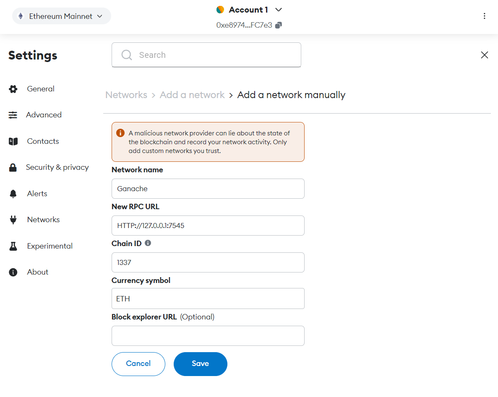
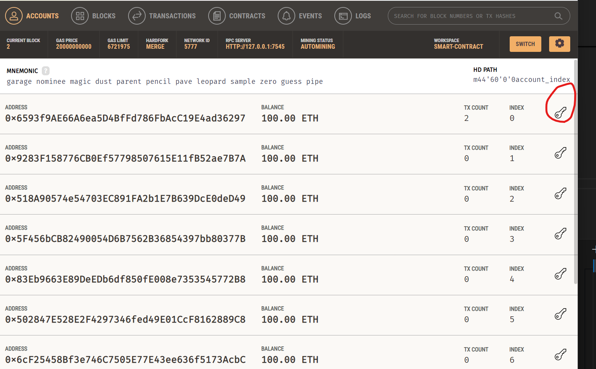
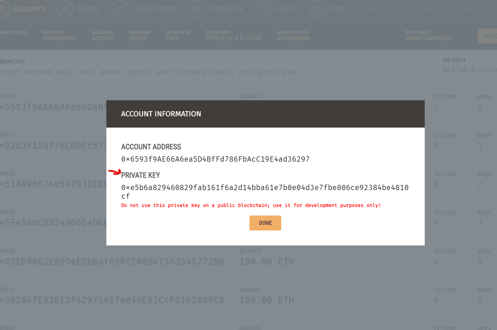

# Smart-Contract

### Smart Contract DApp with React

This repository contains a decentralized application (DApp) built with React that interacts with a smart contract deployed on the Ethereum blockchain. The project demonstrates how to integrate a frontend React application with a smart contract using Web3.js or Ethers.js.

## Features

- Smart Contract Deployment: Solidity smart contract for basic functionalities.
- React Integration: Connect and interact with the smart contract using a React frontend.
- Web3/Ethers Integration: Utilize Web3.js or Ethers.js for blockchain interactions.
- Metamask Authentication: Allow users to connect and authenticate with their Metamask wallet.
- State Management: Efficient state management using React hooks and context.
- User Interface: Clean and responsive UI for interacting with the smart contract.
- Transaction Handling: Display and handle blockchain transactions and events.

## Technologies Used

- Solidity: For writing the smart contract.
- React: For building the user interface.
- Web3.js/Ethers.js: For blockchain interaction.
- Metamask: For user authentication.
- Bootstrap/Material-UI: For styling the application.

## Getting Started

To get a local copy up and running, follow these simple steps.

## Prerequisites

- Node.js and npm installed
- Truffle or Hardhat for smart contract development
- Ganache for local Ethereum blockchain (optional)
- Metamask browser extension

## Installation

### 1.Clone the repo

`git clone repo-url`

### 2.Install NPM packages

`npm install`

### 3.Install Ganache Ethereum And MetaMask

Download Ganache Ethereum app: https://archive.trufflesuite.com/ganache/
Download MetaMask: https://metamask.io/download/

1. After installation and opening the GUI choose "New Workspace" button.
2. Write your workspace name and press "Add project".
3. Navigate to the dapp folder and choose truffle-config file.
4. Press "start" button to add the truffle project to the Ganache.

### 4.Add Ganache Network To MetaMask

1. Open MetaMask chrome extension

2. Choose to Add Network
 
 

3. Fill in the form with these info

Network name: Ganache
New RPC URL: HTTP://127.0.0.1:7545
ChainID: 1337
Currency symbol: ETH

4. Press save and switch to ganache

5. Add account and import ganache private key to your wallet to get fake ETH.

 
### 5.Compile and Deploy Smart Contract

Using Truffle:
`npx truffle compile
npx truffle migrate`

### 6.Start the React App

`npm start`

## Usage

1. Open your browser and navigate to http://localhost:3000.
2. Connect your Metamask wallet.
3. Interact with the deployed smart contract using the provided UI.

## Project Structure

- contracts/: Solidity smart contract files.
- src/: React application source files.
  - pages/: React pages.
  - services/: React services.
  - layout/: Layout of project.
  - middleware/: middleware of project.
  - App.js: Main React component.
  - index.js: Entry point for the React app.
